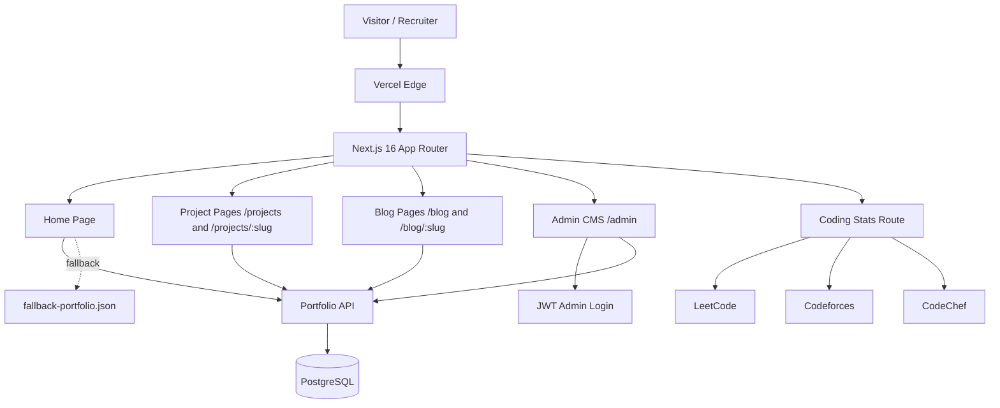
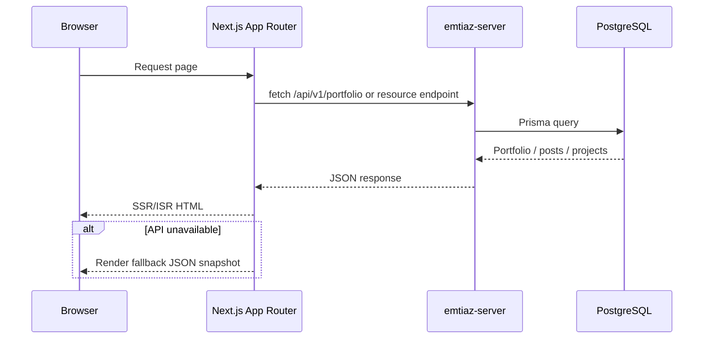

<div align="center">

# emtiaz-client

**A production-style portfolio frontend for Emtiaz Ahmed.**

Next.js 16 + React 19 portfolio with API-driven projects, writing, achievements, coding stats, and a private admin CMS for content updates.

[](https://emtiaz-client.vercel.app)
[](https://github.com/Emtiaz-ahmed-13/emtiaz-server)
[](#license)


</div>

---

## Overview

`emtiaz-client` is the frontend for a full-stack personal portfolio. It is not a static landing page: the home page, project case studies, blog posts, achievements, and contact flow are powered by a companion Express + Prisma API.

The site is designed to work well for both recruiters and technical reviewers:

- **First scan:** clear role, social links, resume, selected projects, writing, and contact CTA.
- **Deep dive:** `/projects/[slug]` case studies with problem, approach, outcome, challenges, screenshots, and tech stack.
- **Content workflow:** private `/admin` CMS for creating/updating projects and blog posts.
- **Resilience:** API-backed rendering with a local JSON fallback so the site still builds and renders if the backend is unavailable.

## Live Links

- **Portfolio:** https://emtiaz-client.vercel.app
- **API:** https://emtiaz-server.vercel.app/api/v1/portfolio
- **Backend repo:** https://github.com/Emtiaz-ahmed-13/emtiaz-server

## Highlights

- **API-driven portfolio data** via `GET /portfolio`
- **Admin CMS** for blog posts and projects (`/admin`, `/admin/blog`, `/admin/projects`)
- **Blog system** with home preview, full `/blog` archive, and `/blog/[slug]` detail pages
- **Project archive** with home preview, full `/projects`, and `/projects/[slug]` case studies
- **Live coding stats** from LeetCode, Codeforces, and CodeChef
- **Image URL safety** for ImgBB share links and direct CDN images
- **Graceful fallback data** from `src/lib/fallback-portfolio.json`
- **Modern UI** with Tailwind CSS 4, Framer Motion, dark theme, and responsive layouts

## Architecture



## Frontend Data Flow



## Tech Stack

| Area | Stack |
|---|---|
| Framework | Next.js 16 App Router |
| UI | React 19, Tailwind CSS 4, Framer Motion |
| Language | TypeScript |
| Content | REST API + fallback JSON |
| Auth client | JWT stored for admin CMS |
| Images | `next/image` + direct CDN URL resolver |
| Hosting | Vercel |

## Route Map

| Route | Purpose |
|---|---|
| `/` | Portfolio home page |
| `/projects` | Full project archive |
| `/projects/[slug]` | Project case study |
| `/blog` | Full writing archive |
| `/blog/[slug]` | Blog post detail |
| `/admin/login` | Admin sign-in |
| `/admin` | Admin overview |
| `/admin/blog` | Blog list / edit / delete |
| `/admin/blog/new` | Create blog post |
| `/admin/projects` | Project list / edit / delete |
| `/admin/projects/new` | Create project |

## Project Structure

```txt
src/
├── app/
│   ├── admin/                 # Private CMS pages
│   ├── api/coding-stats/      # Coding profile refresh endpoint
│   ├── blog/                  # Blog archive + post pages
│   ├── projects/              # Project archive + case studies
│   ├── layout.tsx             # Fonts, metadata, hydration guard
│   └── page.tsx               # Home page composition
├── components/
│   ├── admin/                 # Admin forms and shared admin UI
│   ├── ui/                    # Reusable primitives
│   ├── blog.tsx               # Home writing preview
│   ├── projects.tsx           # Home project preview
│   ├── project-card.tsx
│   ├── footer.tsx
│   └── ...
├── lib/
│   ├── api.ts                 # API client + fallback behavior
│   ├── auth.ts                # Admin session helpers
│   ├── coding-stats.ts
│   ├── fallback-portfolio.json
│   └── image-url.ts           # ImgBB URL normalization
└── types/
    └── portfolio.ts
```

## Getting Started

```bash
git clone git@github.com:Emtiaz-ahmed-13/emtiaz-client.git
cd emtiaz-client
npm install
cp .env.example .env.local
npm run dev
```

Default local URL:

```txt
http://localhost:3000
```

The backend should run on:

```txt
http://localhost:5001/api/v1
```

If the backend is down, the public site still renders from the fallback snapshot. The admin CMS requires the backend.

## Environment Variables

| Key | Required | Example |
|---|---|---|
| `NEXT_PUBLIC_API_URL` | Yes | `http://localhost:5001/api/v1` |

## Scripts

| Command | Purpose |
|---|---|
| `npm run dev` | Start Next.js dev server |
| `npm run build` | Build production app |
| `npm run start` | Run production build |
| `npm run lint` | Run ESLint |

## Deployment

The frontend is deployed to Vercel. Set:

```txt
NEXT_PUBLIC_API_URL=https://emtiaz-server.vercel.app/api/v1
```

Then push to `main`.

## Related Repository

- Backend: [Emtiaz-ahmed-13/emtiaz-server](https://github.com/Emtiaz-ahmed-13/emtiaz-server)

## License

MIT © [Emtiaz Ahmed](https://github.com/Emtiaz-ahmed-13)
